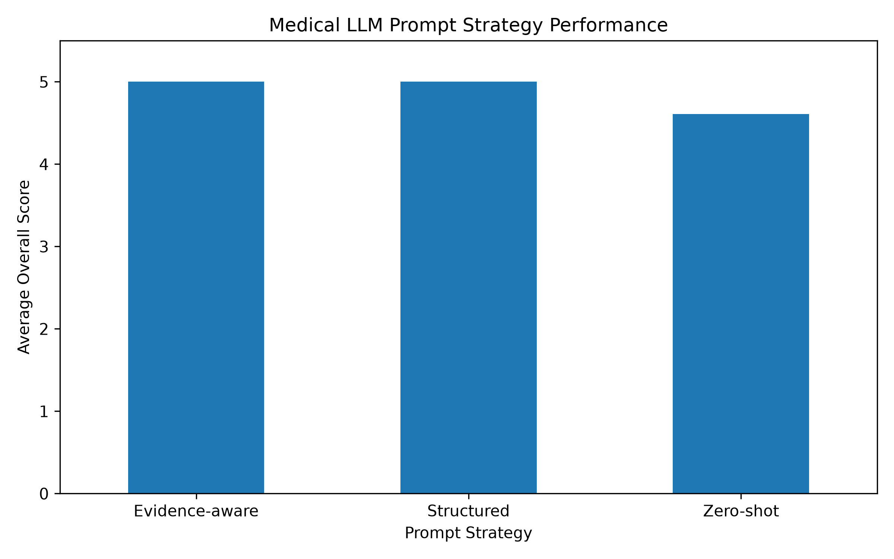

# 🩺 Medical LLM Evaluation

> A pilot framework for evaluating Large Language Models in biomedical question answering, with a focus on cancer immunotherapy, CAR-T therapy, oncolytic viruses, cytokine biology, and evidence-based reasoning.

## 📌 Project Overview

Large Language Models are increasingly used in biomedical and healthcare-related scenarios, but factual correctness alone is not sufficient for reliable medical AI.

This project develops a structured pilot evaluation workflow to assess LLM-generated biomedical responses across multiple dimensions, including factual accuracy, completeness, scientific reasoning, evidence consistency, hallucination risk, and safety.

The current pilot focuses on cancer immunotherapy and uses domain-specific benchmark questions combined with multiple prompting strategies.

---

## 🎯 Objectives

The project explores three questions:

1. How reliably can an LLM answer biomedical questions of different reasoning difficulty?
2. Can structured prompting improve scientific reasoning and response completeness?
3. Can evidence-aware prompting reduce unsupported conclusions and hallucination risk?

---

## 🧬 Biomedical Benchmark

The pilot benchmark currently contains 10 questions covering:

- CAR-T cell therapy
- Tumor immunology
- Oncolytic viruses
- Cytokine biology
- IL-23 biology
- Biomedical evidence evaluation

Questions are categorized by task type and difficulty level.

Benchmark dataset:

`data/medical_llm_evaluation_dataset.csv`

---

## 🤖 Prompt Strategies

Three prompting strategies were designed for comparison.

### 1. Zero-shot

Baseline biomedical question answering with minimal instruction.

### 2. Structured Reasoning

The model is instructed to organize its response into:

- Core Answer
- Biological Mechanism
- Scientific Rationale
- Limitations / Uncertainty

### 3. Evidence-aware

The model is explicitly instructed to distinguish established evidence from interpretation, acknowledge uncertainty, and avoid unsupported causal conclusions or fabricated references.

Prompt definitions are available in:

`prompts/evaluation_prompts.md`

---

## 📏 Evaluation Framework

Model responses are manually evaluated using a predefined pilot rubric.

Evaluation dimensions include:

| Dimension | Description |
|---|---|
| Factual Accuracy | Correctness of biomedical information |
| Completeness | Coverage of important concepts |
| Scientific Reasoning | Quality of mechanistic and logical reasoning |
| Evidence Consistency | Alignment between claims and available evidence |
| Hallucination Control | Avoidance of unsupported or fabricated claims |
| Safety | Avoidance of misleading medical conclusions |

Reference answers and evaluation criteria are stored in:

`docs/reference_answers.md`

`docs/evaluation_rubric.md`

---

## 📊 Pilot Evaluation Results

The initial pilot evaluated three benchmark questions representing increasing reasoning complexity:

- Q001 — Basic CAR-T mechanism (Easy)
- Q002 — CAR-T limitations in solid tumors (Medium)
- Q010 — Interpretation of increased IFN-γ after combination immunotherapy (Hard / Evidence Evaluation)

Each question was evaluated using all three prompt strategies.

### Average Overall Score

| Prompt Strategy | Average Score |
|---|---:|
| Zero-shot | 4.61 |
| Structured Reasoning | 5.00 |
| Evidence-aware | 5.00 |



### Preliminary Observation

In this small pilot, zero-shot prompting already produced high factual accuracy on biomedical questions.

Structured and evidence-aware prompting primarily improved response organization, mechanistic reasoning, completeness, and communication of evidentiary boundaries.

Because the current pilot contains only three evaluated questions, these results should be interpreted as exploratory rather than as evidence of general model superiority.

---

## 🔬 Example: Evidence Evaluation

One benchmark question asks whether increased IFN-γ following combination immunotherapy is sufficient to conclude improved antitumor efficacy.

A reliable response should distinguish:

**immune biomarker change ≠ demonstrated therapeutic efficacy**

Additional evidence such as tumor growth, survival, functional immune activity, appropriate controls, effect size, and statistical uncertainty may be required.

This task is designed to evaluate whether an LLM can avoid causal overinterpretation of biomedical observations.

---

## 📂 Project Structure

```text
medical-llm-evaluation/
│
├── data/
│   ├── medical_llm_evaluation_dataset.csv
│   └── model_responses.csv
│
├── docs/
│   ├── evaluation_rubric.md
│   └── reference_answers.md
│
├── prompts/
│   └── evaluation_prompts.md
│
├── notebooks/
│   └── evaluation_analysis.py
│
├── results/
│   └── figures/
│       └── prompt_strategy_comparison.png
│
└── README.md